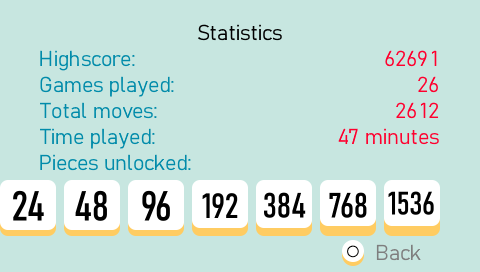

# Threes on the Playstation Portable

An unofficial implementation of the [Threes Game](http://playthrees.com/) for PSP.

## Features

- Rules of the Threes game
- Next card preview
- Hold to move or Press to move
- Analog stick preview mode
- Saves in progress games
- Saves highscore and player stats

## Screenshots

## Installation

You need a PSP that can run homebrew games.

1. Create the folder `/PSP/GAME/Threes/` on your Memory Stick
2. Move the `EBOOT.PBP` file into that folder

Alternatively, you can run this game in the PPSSPP emulator.